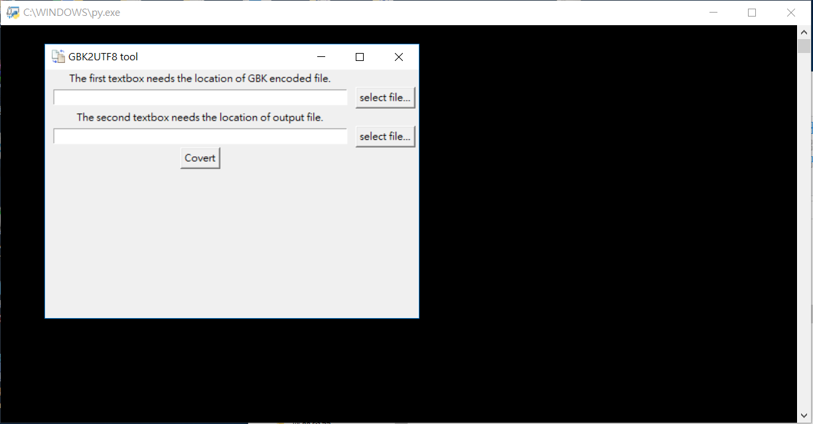
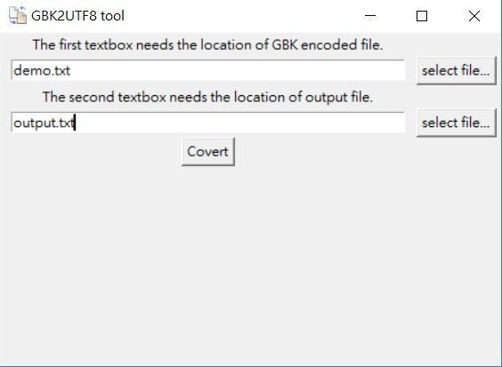
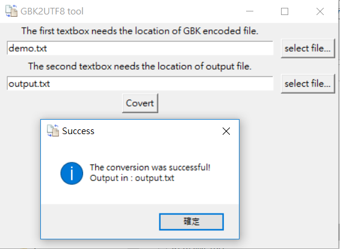

# part 1. Introduction

## Implementation of a program that converts GBK encoded files into UTF-8 encoded files.

# part 2. Quick start
## 1. Clone this file
```bashrc
$ git clone https://github.com/po1234263/gbk2utf8.git
```
## 2. How to use it ?
```bashrc
$ cd gbk2utf8
$ python demo.py
```

## 3. If you don't have any GBK encoded files, I have provided a sample file(demo.txt).
```bashrc
$ type demo.txt                		           # show the demo file on Windows (optional)
$ cat demo.txt                 			   # show the demo file on Linux (optional)
```

<br>
## 4. Then you can use the demo.py to convert this demo file to UTF-8 encoded.

<br>
## 5. If the conversion is successful, the following screen will be output.

<br>
## 6. Finally, we can open the output.txt to view the converted file.
